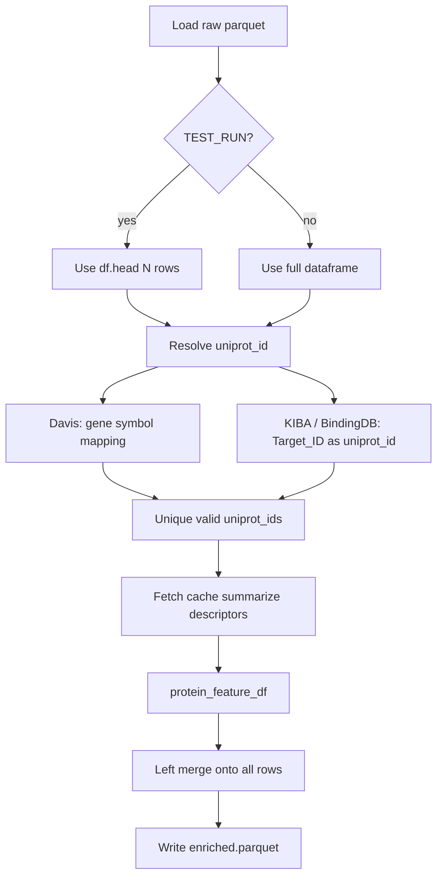

# All-Protein-Feature-Data — Protein Feature Enrichment for DTI Datasets

I built this repository to enrich three drug–target interaction (DTI) benchmark datasets—**Davis**, **KIBA**, and **BindingDB-KD**—with complete protein-level features from UniProt. Each raw interaction row is conjugated (left-merged) with metadata and sequence-derived descriptors so downstream models can use both the original affinity data and rich protein representations keyed by a normalized UniProt accession.

---

## Dataset documentation

Full analytics, parquet schemas, and feature descriptions are in **[`docs/`](docs/README.md)**:

- [Feature catalog](docs/feature_catalog.md) — UniProt metadata, AAC, PAAC, CTD
- [Processed overview](docs/processed/overview.md) — cross-dataset comparison
- [Train-ready overview](docs/trainready/overview.md) — CTD-filtered modeling inputs
- [CTD feature selection](docs/trainready/ctd_feature_selection.md) — methodology & findings
- Per-dataset reports: [`docs/raw/`](docs/raw/), [`docs/processed/`](docs/processed/), [`docs/trainready/`](docs/trainready/)
- Complete column-level schemas under [`docs/schemas/`](docs/schemas/)

Regenerate after data changes: `python _generate_docs.py`

### CTD feature selection (train-ready)

Notebook **`ctd_feature_selection.ipynb`** applies variance + correlation filtering on `ctd__*` columns and writes:

- `data/trainready/{dataset}_trainready.parquet`
- `data/trainready/reports/dropped_ctd_features.json` (and per-dataset reports)

Does **not** modify `data/processed/`.

---

## What I Did

### Problem I set out to solve

My earlier work in `protein_feature_extraction.ipynb` showed how to pull UniProtKB records, cache JSON, summarize annotations, and compute AAC / PAAC / CTD descriptors for a small list of UniProt IDs. I needed the same capability **at scale** for three parquet datasets, with dataset-specific protein ID handling (especially Davis gene symbols) and reproducible outputs in parquet format.

### Main deliverable

I created **`protein_feature_enrichment_batch.ipynb`** at the project root. It is a self-contained notebook that:

1. Sets up a `data/` directory tree and copies raw parquets from `raw/` when needed.
2. Resolves each row’s protein to a **`uniprot_id`** (with Davis-specific gene-symbol mapping).
3. Fetches UniProt JSON (with disk cache and retries), summarizes metadata, and computes descriptors.
4. Left-merges features back onto every DTI row.
5. Writes **`.parquet`** outputs for test runs and full runs.

I intentionally did **not** modify the reference notebooks and did **not** include 3D structure features (PDB/AlphaFold)—only sequence and UniProt annotation features, matching my reference pipeline minus the structure section.

### Reference notebooks (read-only)

| File | Role |
|------|------|
| `protein_feature_extraction.ipynb` | Source logic for UniProt fetch/cache, `summarize_uniprot_record`, AAC/PAAC/CTD, and `protein_feature_df` (~232 feature columns). |
| `fetch_protein_for_davis.ipynb` | Davis `Target_ID` → UniProt mapping via `map_target_to_uniprot()` (gene symbol + human organism, strip trailing `p`). |

---

## Repository Layout

```text
All-Protein-Feature-Data/
├── README.md                              # this file
├── protein_feature_enrichment_batch.ipynb # batch enrichment pipeline (run this)
├── protein_feature_extraction.ipynb       # reference: small-scale UniProt demo
├── fetch_protein_for_davis.ipynb          # reference: Davis mapping smoke test
├── raw/                                   # original parquet inputs
│   ├── davis.parquet
│   ├── kiba.parquet
│   └── bindingdb_kd.parquet
└── data/                                  # pipeline working & output directory
    ├── raw/                               # copies used by the notebook
    ├── cache/
    │   ├── uniprot_json/                  # one JSON file per UniProt accession
    │   ├── davis_target_to_uniprot.tsv    # persistent Davis gene → UniProt map
    │   └── protein_features_{dataset}.parquet  # (full run) cached feature tables
    ├── testrun/                           # smoke test: first 10 rows per dataset
    └── processed/                         # full-scale enriched outputs (after FULL_RUN)
```

---

## Getting Started (Clone This Repository)

Large dataset and output files in this repo are stored with **Git LFS**. If you clone without LFS, you will only get small pointer files instead of real `.parquet` / `.tsv` data.

### Prerequisites

1. **Git** — https://git-scm.com/downloads  
2. **Git LFS** — https://git-lfs.github.com/

Install Git LFS once on your machine, then enable it for your user account:

```powershell
# Windows (winget)
winget install GitHub.GitLFS

# macOS (Homebrew)
brew install git-lfs

# Linux (Debian/Ubuntu)
sudo apt install git-lfs

# Enable LFS globally (run once per machine)
git lfs install
```

### Clone the repository

Replace the URL with this repository’s actual remote.

```powershell
git clone https://github.com/gazimaksudur2/All-Protein-Feature-Data.git
cd All-Protein-Feature-Data
```

SSH:

```powershell
git clone git@github.com/gazimaksudur2/All-Protein-Feature-Data.git
cd All-Protein-Feature-Data
```

If you already cloned **before** installing Git LFS, pull the real files afterward:

```powershell
cd All-Protein-Feature-Data
git lfs install
git lfs pull
```

### Verify LFS files downloaded correctly

```powershell
git lfs ls-files
```

You should see pointer entries with a `*` (LFS object present locally), for example:

```text
data/cache/davis_target_to_uniprot.tsv
data/testrun/davis_enriched.parquet
data/testrun/kiba_enriched.parquet
data/testrun/bindingdb_kd_enriched.parquet
```

Quick sanity check — file sizes should be hundreds of KB or larger, not ~130 bytes:

```powershell
# PowerShell
Get-ChildItem data/testrun/*.parquet | Select-Object Name, Length
```

```bash
# macOS / Linux
ls -lh data/testrun/*.parquet
```

If sizes look like pointer stubs, run `git lfs pull` again.

### What is tracked in Git vs Git LFS

| Path | Storage | Notes |
|------|---------|--------|
| `protein_feature_enrichment_batch.ipynb` | Git | Main pipeline |
| `README.md`, `.gitattributes`, `.gitignore` | Git | Docs and LFS rules |
| `data/testrun/*_enriched.parquet` | **Git LFS** | Smoke-test enriched outputs (10 rows each) |
| `data/cache/davis_target_to_uniprot.tsv` | **Git LFS** | Davis gene → UniProt map (partial cache from test run) |
| `data/raw/*.parquet` | *Not in repo* | Raw DTI inputs — see below |
| `data/cache/uniprot_json/` | *Not in repo* | Regenerable; created when you run the notebook |
| `data/processed/` | *Not in repo* | Full-run outputs; created with `FULL_RUN = True` |
| `raw/` | *Not in repo* | Ignored by `.gitignore` (optional local copy of inputs) |
| `protein_feature_extraction.ipynb`, `fetch_protein_for_davis.ipynb` | *Not in repo* | Reference notebooks (local only unless you add them) |

LFS patterns are defined in `.gitattributes`:

```gitattributes
*.parquet filter=lfs diff=lfs merge=lfs -text
data/cache/uniprot_json/*.json filter=lfs diff=lfs merge=lfs -text
data/cache/*.tsv filter=lfs diff=lfs merge=lfs -text
```

### Raw input data (required to run the full pipeline)

The notebook reads from **`data/raw/`**. Those three parquets are **not** currently committed to this repository. After cloning, either:

**Option A — Place files manually**

Put `davis.parquet`, `kiba.parquet`, and `bindingdb_kd.parquet` into `data/raw/`.

**Option B — Use the legacy `raw/` folder**

Copy them into `raw/` at the project root; the notebook’s `ensure_data_dirs()` will copy them into `data/raw/` on first run if `data/raw/` is missing.

You need network access and UniProt API availability to generate features for datasets not already present in `data/testrun/`.

### Python environment (after clone)

```powershell
cd YOUR_REPO
python -m venv .venv
.\.venv\Scripts\Activate.ps1   # Windows
# source .venv/bin/activate    # macOS / Linux

pip install requests pandas numpy tqdm propy3 biopython pyarrow jupyter
```

Or open `protein_feature_enrichment_batch.ipynb` in Jupyter / VS Code and run the first cell (`%pip install ...`).

### Run the pipeline

1. Start Jupyter from the repo root so `Path.cwd()` is the project directory.  
2. Open `protein_feature_enrichment_batch.ipynb`.  
3. Run all cells through **Configuration**, then the **Test run** or **Full-scale run** section.

See [How to Run](#how-to-run) for flags (`TEST_RUN`, `FULL_RUN`, etc.).

### Troubleshooting (clone / LFS)

| Problem | Fix |
|---------|-----|
| Parquet files are tiny (~130 B) | Install Git LFS, run `git lfs install`, then `git lfs pull` |
| `git lfs pull` fails with 404 / auth | Ensure you have repo access; for private repos, use SSH or a personal access token |
| `data/raw/` missing | Add the three raw parquets manually (see above) |
| Notebook can’t find data | Run Jupyter from the repo root, not a parent folder |
| Re-running setup duplicates folders | It does not — `mkdir(..., exist_ok=True)` and parquet copy are skipped if paths already exist |

---

## Raw Data

All three datasets share the same schema (5 columns):

| Column | Description |
|--------|-------------|
| `Drug_ID` | Compound identifier (format differs by source) |
| `drug_smiles` | SMILES string |
| `Target_ID` | Protein identifier (**format differs by dataset—see below**) |
| `target_sequence` | Amino acid sequence bundled with the benchmark |
| `affinity_label` | Affinity / activity label (dataset-specific scale) |

### Dataset statistics I verified

| Dataset | Rows | Unique `Target_ID` | Protein ID format |
|---------|------|-------------------|-------------------|
| **Davis** | 25,772 | 379 | Gene symbols (`AAK1`, `ABL1p`, `ACVR1`, …) — **not** UniProt; requires mapping |
| **KIBA** | 117,657 | 229 | UniProt accessions (`O00141`, `P00533`, …) |
| **BindingDB-KD** | 52,274 | 1,090 (valid) | Mostly UniProt; **4,333 rows have null `Target_ID`** (~8.3%) |

### Findings that shaped the pipeline

- **Davis** uses kinase gene names, not UniProt IDs. I map each symbol to a human UniProt accession using UniProt search (`gene:{symbol} AND organism_id:9606`, with fallback to `entry_name`). Trailing `p` on symbols (e.g. `ABL1p`) is stripped before search, consistent with my Davis reference notebook.
- **KIBA** already uses UniProt accessions in `Target_ID`, so I set `uniprot_id = Target_ID` directly.
- **BindingDB-KD** is mostly UniProt, but null targets must be handled explicitly: those rows receive no protein features and are logged in a failures file rather than breaking the run.

---

## Enriched Output Format

Each enriched parquet contains:

- **All 5 original raw columns** unchanged.
- **`uniprot_id`** — normalized UniProt accession used for fetching.
- **`map_error`** — populated when mapping fails (Davis) or `Target_ID` is null (BindingDB).
- **~232 protein feature columns**, including:
  - **Metadata** (~25): sequence length, molecular weight, GO terms, keywords, Reactome, subcellular location, function/pathway text, feature-table counts (domains, transmembrane, variants, etc.), PDB ID list/count.
  - **Descriptors** (~207): AAC (20), PAAC (~40), CTD (~147) via **propy3**, with pure-Python fallbacks if propy is unavailable.

In my test run, each enriched file had **239 columns total** (5 raw + `uniprot_id` + `map_error` + feature columns; exact count may vary slightly if descriptor sets differ).

### Conjugation logic

I fetch features **once per unique `uniprot_id`**, not once per row, then left-merge:

```python
enriched = raw_df.merge(protein_feature_df.reset_index(), on="uniprot_id", how="left")
```

This keeps API usage reasonable (~379 + 229 + ~1,090 unique proteins for a full run, with overlap across datasets reducing duplicate fetches thanks to the shared JSON cache).

---

## Test Run Results (Completed)

I ran a smoke test on the **first 10 rows** of each dataset (`TEST_RUN = True` → `data/testrun/`).

| Output file | Rows | Columns | Notes |
|-------------|------|---------|-------|
| `davis_enriched.parquet` | 10 | 239 | 10 unique proteins fetched; mapping verified (e.g. `AAK1` → `Q2M2I8`, `ABL1p` → `P00519`) |
| `kiba_enriched.parquet` | 10 | 239 | 10 unique UniProt IDs fetched |
| `bindingdb_kd_enriched.parquet` | 10 | 239 | 1 unique ID in first 10 rows (`P00918` repeated) |

At the time of writing, I have **21 cached UniProt JSON files** under `data/cache/uniprot_json/` and a Davis mapping cache at `data/cache/davis_target_to_uniprot.tsv` (10 targets from the smoke test).

**Full-scale outputs** (`data/processed/`) are not generated yet. I left that for a deliberate full run with `FULL_RUN = True`.

---

## How to Run

### Dependencies

The notebook installs these via `%pip`:

`requests`, `pandas`, `numpy`, `tqdm`, `propy3`, `biopython`, `pyarrow`

### Steps

1. Open `protein_feature_enrichment_batch.ipynb` from this directory (`ROOT = Path.cwd()`).
2. Run the install and core pipeline cells.
3. **Smoke test** (default config):
   - `TEST_RUN = True`
   - `FULL_RUN = False`
   - `N_TEST_ROWS = 10`
   - Outputs → `data/testrun/`
4. **Full run** (after validating test outputs):
   - `TEST_RUN = False`
   - `FULL_RUN = True`
   - Outputs → `data/processed/`

### Configuration flags

| Flag | Default | Purpose |
|------|---------|---------|
| `TEST_RUN` | `True` | Process only `df.head(N_TEST_ROWS)` |
| `FULL_RUN` | `False` | Process entire datasets |
| `N_TEST_ROWS` | `10` | Rows per dataset in test mode |
| `REQUEST_DELAY_S` | `0.35` | Delay between UniProt API calls (increase if you see 429 errors) |
| `FORCE_REFETCH` | `False` | Ignore JSON and feature parquet caches |

### Expected runtime (full run)

- Roughly **~1,700 unique UniProt lookups** across all datasets (less with cache hits on overlap).
- Dominated by UniProt REST latency and descriptor computation; progress bars show per-dataset fetch status.
- BindingDB: expect ~8% of rows to retain NaN protein features where `Target_ID` is null.

---

## Pipeline Overview



---

## Caching Strategy

I designed caching so re-runs are cheap and resumable:

| Cache | Location | Purpose |
|-------|----------|---------|
| UniProt JSON | `data/cache/uniprot_json/{accession}.json` | Avoid re-downloading raw records |
| Davis mapping | `data/cache/davis_target_to_uniprot.tsv` | Avoid re-querying gene → UniProt |
| Feature table | `data/cache/protein_features_{dataset}.parquet` | Skip recompute on full re-run (when `FORCE_REFETCH=False`) |

Failures are written to `data/{testrun|processed}/{dataset}_fetch_failures.parquet` when mapping or fetch errors occur.

---

## What I Explicitly Excluded

- **3D structure features** (PDB CIF download, AlphaFold, structure-derived descriptors from the reference notebook).
- **Long-format** per-residue UniProt `features` tables (one row per domain/region); the batch pipeline produces **wide** row-level features for ML merges.
- Edits to `protein_feature_extraction.ipynb` or `fetch_protein_for_davis.ipynb`.

---

## Next Steps (for me)

1. Run the notebook with `FULL_RUN = True` to produce `data/processed/*_enriched.parquet` for all three datasets.
2. Review `*_fetch_failures.parquet` for any Davis symbols that failed mapping and decide on manual overrides if needed.
3. Plug enriched parquets into downstream DTI modeling pipelines.

---

## Quick File Reference

| Path | Description |
|------|-------------|
| `protein_feature_enrichment_batch.ipynb` | **Primary entry point** — run this |
| `data/raw/*.parquet` | Inputs used by the pipeline |
| `data/testrun/*_enriched.parquet` | 10-row smoke-test outputs (done) |
| `data/processed/*_enriched.parquet` | Full-scale outputs (pending full run) |
| `data/cache/uniprot_json/` | Cached UniProt REST responses |
| `data/cache/davis_target_to_uniprot.tsv` | Davis gene symbol → UniProt map |
